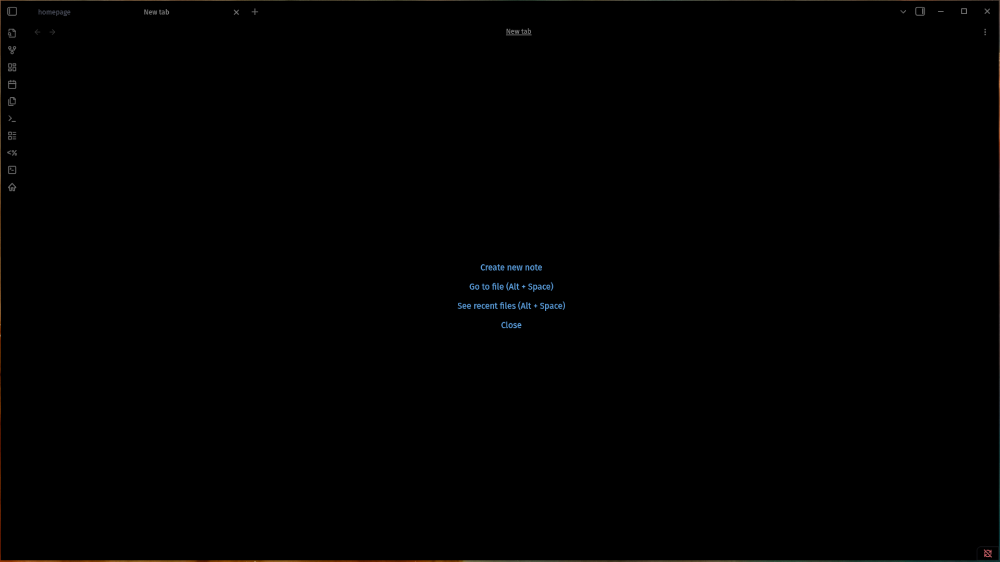

# True Black

A theme for Obsidian with a true and pitch-black background and a simple and sensible color scheme based on Atom's dark theme.

For people who like the night and want to embrace the darkness.

It also does **not include** any light theme version.

## Demo

  

## Features

  - [!] darkness
  - [!] atom colors

## Installation

  1. In Obsidian under Settings > Appearance > Theme > Manage.
  2. Search for True Black and install.

## Tasks

List of things done

  - [!] take a screenshot: `./data/shot_1920x1080px.png`

## Feedback

I can be reached via [alex@kraasch.eu](mailto:alex@kraasch.eu).

## Contributing

Feel free to help me.

## Acknowledgments

Originally borrowed from [obsidian-atom](https://github.com/kognise/obsidian-atom/).

Made by the following people:

  - see Github info.

## License

View the [license file](./LICENSE).

## Misc

For how to making your own theme see the [obsidian hub guide](https://publish.obsidian.md/hub/04+-+Guides%2C+Workflows%2C+%26+Courses/Guides/How+to+add+your+theme+to+the+community+theme+store) on community themes.

